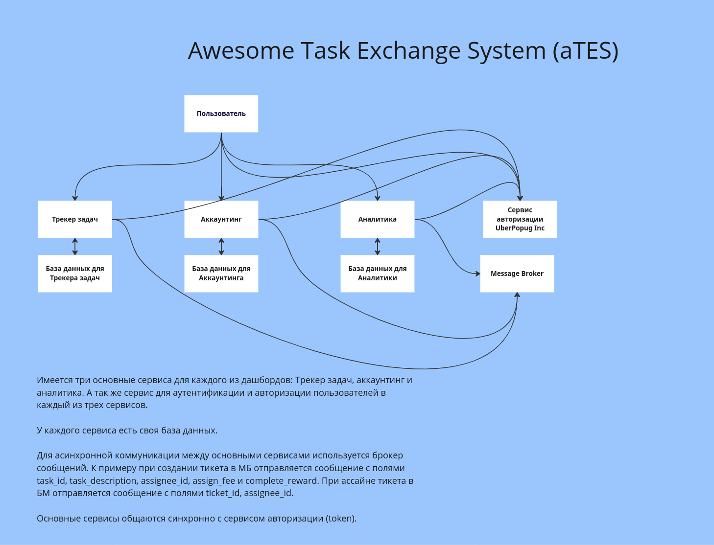

# Диаграмма системы

# Описание диаграммы, сервисов на ней и взаимодействия между ними

- Создание пользователя
    - [Au] отправить данные нового пользователя в МБ с полями `user_id`, `role_id`
    - [Tr] получает сообщение о новом пользователе из МБ и создает запись в базе
    - [Ac] получает сообщение о новом пользователе из МБ и создает запись в базе
    - [An] получает сообщение о новом пользователе из МБ и создает запись в базе
- Создание тикета
    - [Tr] Создается запись в базе с тикетом
        - опеределяется исполнитель (рандомно)
        - опеределяется комиссия за ассайн
        - опеределяется награда за выполнение
    - [Tr] выполняются задачи при ассайне тикета
- Ассайн тикета на юзера
    - [Tr] Отправка сообщения в МБ с полями `ticket_id`, `assignee_id`
- Закрытие тикета
    - [Tr] Смена статуса тикета в базе
    - [Tr] Отправка сообщения в МБ с полями `ticket_id`, `assignee_id`
    - [Ac] При получении сообщения
        - создает запись с логом изменения баланса
        - обновляет баланс дня
- Выплата зарплаты
    - [Ac] Раз в день для каждого пользователя с положительным балансом
        - нулит баланс
        - отправляет письмо с зарплатой
        - создает запись о изменении баланса
