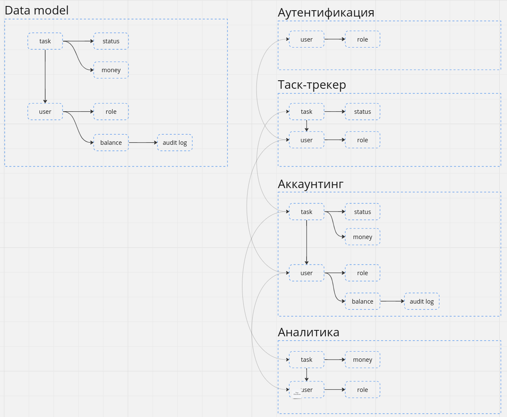
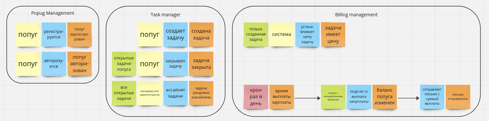

# Первая неделя (уроки 2 и 3)

# Модель данных

# Домены и изоляция

# Список сервисов
- auth
- tracker
- analytics
- accounting

# Коммуникции между сервисами

## Асинхронные связи между сервисами:
- task manager и accounting
    - при создании тикета
    - при ассайне тикета
    - при закрытии тикета
- task manager и analytics
    - при создании тикета
    - при ассайне тикета
    - при закрытии тикета
- auth с остальными
    - создание пользователя

## Синхронные свзяи между сервисами: 
- auth и остальные три сервиса task manager, analytics и accounting

# Список событий

- Создание пользователя
  - Продюсер `auth` отправляет событие `user_created` в `message broker` с полями `user_id` и `role`
  - Консьюмер `tracker` получает событие `user_created`
  - Консьюмер `accounting` получает событие `user_created`
  - Консьюмер `analytics` получает событие `user_created`
- Создание тикета
  - Продюсер `tracker` отправляет событие `ticket_created` в `message broker` с полями `ticket_id`, `assignee_id`
  - Консьюмер `accounting` получает событие `ticket_created`
- Установка комиссии за тикет
  - Продюсер `accounting` отправляет событие `ticket_money_updated` с полями `ticket_id`, `commission`, `reward`
  - Консьюмер `analytics` получает событие `ticket_money_updated`
- Ассайн на тикет
  - Продюсер `tracker` отправляет событие `ticket_reassigned` в `message broker` с полями `ticket_id`, `assignee_id`
  - Консьюмер `accounting` получает событие `ticket_reassigned`
  - Консьюмер `analytics` получает событие `ticket_reassigned`
- Закрытие тикета
  - Продюсер `tracker` отправляет событие `ticket_closed` в `message broker` с полями `ticket_id`
  - Консьюмер `accounting` получает событие `ticket_reassigned`
  - Консьюмер `analytics` получает событие `ticket_reassigned`
- Выплата зарплаты
  - Продюсер `accounting` отправляет событие `user_wage_paid` в `message broker` с полями `user_id`, `amount`
  - Консьюмер `analytics` получает событие `user_wage_paid`
